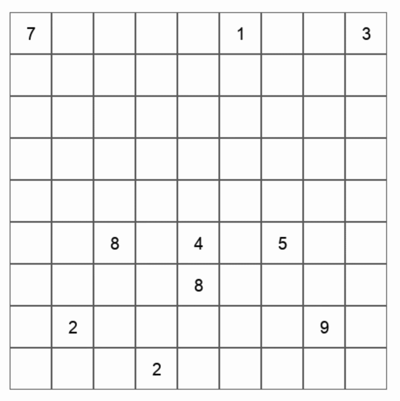

# Sudoku Solver Using Backtracking and Pygame 
<p align="left">
  
</p>

## Description
This project implements a backtracking algorithm to solve Sudoku puzzles.  
The solver explores possible values recursively and backtracks when a constraint is violated.

A Pygame-based interface visualizes the solving process in real time, showing both forward progress and backtracking steps as the algorithm searches for a valid solution.

## Key Concepts

- Backtracking (recursive problem solving)
- Constraint validation (rows, columns, and 3x3 grids)
- Real-time visualization using Pygame
- Separation of solving logic and rendering

## How to Run
Installing dependencies:
```bash
pip install pygame
```
Running the program:
```bash
python solver.py
```
The Sudoku board is currently hardcoded in 'solver.py', but you can modify it to test different puzzles.

## Future Improvements 
- Choose cells with the fewest valid options
- Reduce unnecessary recursion when only one valid move exists
- Add color coding to highlight solving and backtracking steps
- Allow user input through the UI instead of hardcoding puzzles
- Integrate image recognition to scan physical Sudoku puzzles
